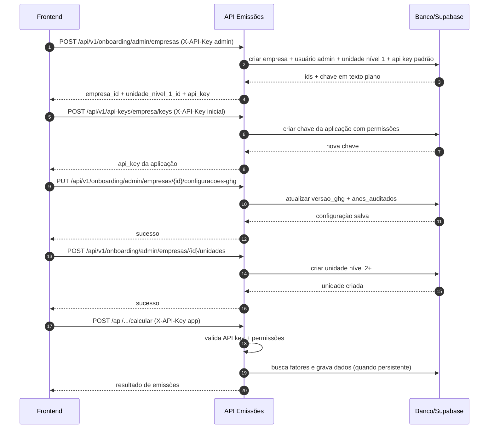

# Guia de Autenticação, API Key e Onboarding

Este guia é focado em frontend e mostra o fluxo completo para sair do zero até o primeiro cálculo autenticado.

## Objetivo

Ao final, você consegue:

1. Criar empresa
2. Gerar API Key para uso da aplicação
3. Configurar versão GHG e anos auditados
4. Criar unidades de negócio
5. Fazer o primeiro cálculo com `X-API-Key`

---

## Visão Rápida do Fluxo

1. Obter uma API Key com permissão administrativa (`gerenciar:usuarios`) para onboarding.
2. `POST /api/v1/onboarding/admin/empresas` para criar empresa inicial.
3. Gerar API Key específica da aplicação (recomendado) em `POST /api/v1/api-keys/empresa/keys`.
4. Configurar GHG em `PUT /api/v1/onboarding/admin/empresas/{empresa_id}/configuracoes-ghg`.
5. Criar unidades em `POST /api/v1/onboarding/admin/empresas/{empresa_id}/unidades`.
6. Executar cálculo com permissão adequada (`calcular:escopoX`).

---

## Como Enviar API Key

Use o header HTTP:

```http
X-API-Key: SUA_CHAVE_AQUI
```

Exemplo `fetch`:

```javascript
const res = await fetch(`${API_BASE}/api/v1/onboarding/admin/empresas`, {
  method: 'POST',
  headers: {
    'Content-Type': 'application/json',
    'X-API-Key': apiKey,
  },
  body: JSON.stringify(payload),
});
```

Observação: o backend também aceita `Authorization: Bearer <chave>`, mas o padrão do projeto é `X-API-Key`.

---

## Armazenamento de API Key (Frontend)

### Recomendado (produção)

1. Não expor API key diretamente no browser.
2. Guardar a chave no backend/BFF (variável de ambiente ou cofre de segredos).
3. Frontend conversa com seu backend, e o backend chama a API de emissões.

### Se precisar chamar direto do frontend (risco maior)

1. Nunca commitar API key em repositório.
2. Evitar `localStorage` para chave de longa duração.
3. Preferir manter em memória de sessão (state) e renovar a partir de backend seguro.
4. Rotacionar chave periodicamente (`/api/v1/api-keys/admin/keys/{id}/regenerar`).

---

## Onboarding End-to-End (Passo a Passo)

### Passo 1: Criar empresa

Endpoint:

`POST /api/v1/onboarding/admin/empresas`

Permissão necessária: `gerenciar:usuarios`

Payload mínimo:

```json
{
  "nome": "Empresa Exemplo Ltda",
  "cnpj": "12345678000199"
}
```

Resposta relevante:

```json
{
  "success": true,
  "empresa": {
    "id": "..."
  },
  "unidade_nivel_1_id": "...",
  "api_key": {
    "id": "...",
    "chave": "...",
    "permissoes": [
      "consultar:resultados",
      "calcular:escopo1",
      "calcular:escopo2",
      "calcular:escopo3"
    ]
  }
}
```

Guarde imediatamente:

1. `empresa.id`
2. `unidade_nivel_1_id`
3. `api_key.chave` (texto plano exibido apenas na criação)

### Passo 2: Gerar API key da aplicação (recomendado)

Endpoint:

`POST /api/v1/api-keys/empresa/keys`

Auth: qualquer API key válida associada à empresa

Payload exemplo:

```json
{
  "nome": "Frontend App",
  "descricao": "Chave usada pela aplicação web",
  "dias_expiracao": 180,
  "permissoes": [
    "consultar:resultados",
    "calcular:escopo1",
    "calcular:escopo2",
    "calcular:escopo3"
  ]
}
```

### Passo 3: Configurar GHG

Endpoint:

`PUT /api/v1/onboarding/admin/empresas/{empresa_id}/configuracoes-ghg`

Permissão necessária: `gerenciar:usuarios`

Payload exemplo:

```json
{
  "versao_ghg": "v2025.0.1",
  "anos_auditados": [2023, 2024, 2025],
  "observacoes": "Configuração inicial"
}
```

### Passo 4: Criar unidades de negócio

Endpoint:

`POST /api/v1/onboarding/admin/empresas/{empresa_id}/unidades`

Permissão necessária: `gerenciar:usuarios`

Payload exemplo:

```json
{
  "nome": "Filial São Paulo",
  "nivel": 2,
  "unidade_pai_id": "UUID_DA_UNIDADE_NIVEL_1"
}
```

### Passo 5: Primeiro cálculo

Use qualquer endpoint de cálculo cujo escopo esteja liberado pela API key (`calcular:escopo1`, `calcular:escopo2`, `calcular:escopo3`).

Exemplo de cabeçalho:

```http
X-API-Key: CHAVE_DA_APLICACAO
```

---

## Permissões e Endpoints Liberados

As permissões são validadas por decorators no backend.

| Permissão | Libera |
|---|---|
| `gerenciar:usuarios` | Endpoints admin de onboarding (`/api/v1/onboarding/admin/**`) |
| `gerenciar:api_keys` | Endpoints admin de chaves (`/api/v1/api-keys/admin/**`) |
| `calcular:escopo1` | Endpoints de cálculo do Escopo 1 que usam `@require_permission("calcular:escopo1")` |
| `calcular:escopo2` | Permissão atribuível às API keys (retornada no onboarding padrão). Verifique no seu ambiente quais endpoints de Escopo 2 estão protegidos por decorator de permissão. |
| `calcular:escopo3` | Endpoints de cálculo do Escopo 3 protegidos por `@require_permission("calcular:escopo3")` |
| `consultar:resultados` | Endpoints de consulta/listagem protegidos por `@require_permission("consultar:resultados")` |
| `consultar:catalogo` | Endpoints de catálogos (ex.: listas de veículos/combustíveis) que exigem catálogo |

Observação importante:

1. `/api/v1/api-keys/empresa/keys` (GET/POST) exige API key válida, mas não exige explicitamente `gerenciar:api_keys`.
2. O endpoint de teste `/api/v1/onboarding/teste` não exige autenticação.

---

## Diagrama de Sequência



---

## Cenários de Erro de Autenticação e Permissão

### 1) API key ausente

Condição: header `X-API-Key` não enviado.

Resposta típica:

```json
{
  "error": "API Key não fornecida"
}
```

Status: `401`

### 2) API key inválida/inativa/expirada

Condição: hash não encontrado, chave inativa ou inválida.

Resposta típica:

```json
{
  "error": "API Key inválida ou expirada"
}
```

Status: `401`

### 3) Sem permissão

Condição: API key válida sem a permissão necessária para o endpoint.

Resposta típica:

```json
{
  "error": "Permissão insuficiente"
}
```

Status: `403`

### 4) API key sem empresa associada (self-service de keys)

Condição: chamada em `/api/v1/api-keys/empresa/keys` com chave sem `id_empresa`.

Resposta típica:

```json
{
  "success": false,
  "error": "API Key não associada a uma empresa"
}
```

Status: `400`

---

## Diferença de Formato de Resposta

1. Endpoints de `/api/v1/api-keys/**` não recebem envelope padronizado global.
2. Endpoints de `/api/v1/onboarding/**` recebem envelope global (`success`, `data`, `error`, `meta`) quando aplicável.

No frontend, trate ambos os formatos durante a fase de integração.

---

## Checklist de Implementação (Frontend)

1. Criar cliente HTTP central que sempre injeta `X-API-Key`.
2. Implementar interceptador para `401` e `403` com mensagens amigáveis.
3. Persistir `empresa_id`, `unidade_nivel_1_id` e metadados de setup.
4. Separar chave de onboarding/admin da chave de runtime da aplicação.
5. Preparar rotação de chave sem downtime.

---

## Testes a Serem Realizados

1. Seguir este guia do zero e confirmar que é possível criar empresa e executar o primeiro cálculo.
2. Testar os cenários de erro documentados (`401`, `403`, `400`) e validar mensagens esperadas.
3. Validar que um dev frontend consegue implementar autenticação sem consultar código backend.